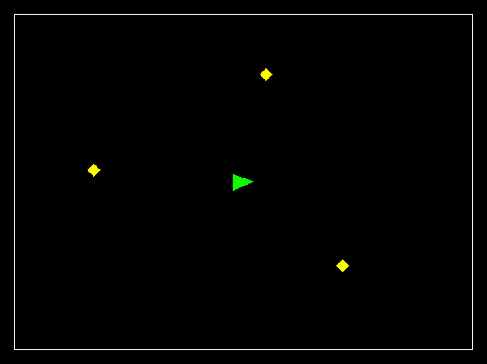
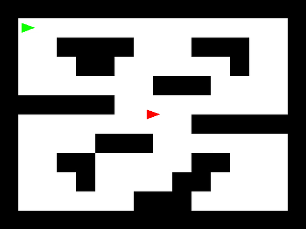
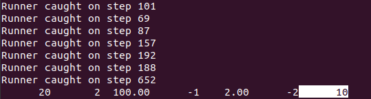

# Tribot

<u>NOTE</u>: Course and instructor name omitted at his request, likely to prevent future students from finding and referencing this repository for solutions

These programs all revolve around the use of a wedge-shaped simulated robot, and either build on each other or use a similar infrastructure to perform various tasks. To view the bitmap applications (for those applicable), open the ``animation.html`` file located in the same folder that holds the program in question. Firefox worked well for me.

## Part 1: Collision

This section involves implementing collision detection and resolution, starting with intersection of polygons and then transferring it over to a simulation environment.

### *collision*
From ``polygons.csv``, takes in the vertices (up to 16), rotation, and translation of two polygons and determines whether they "collide", which we define as either intersecting or having one shape nested inside of the other.
- This program is used as a function in all subsequent programs for collision detection and resolution

### *braitenberg*
Simulates the behavior of a [Braitenberg vehicle](https://en.wikipedia.org/wiki/Braitenberg_vehicle) in an environment with three lamps.
- Unit vectors from the vehicle to each lamp are calculated, then the inner product between that vector and the vectors along which the light sensors are facing (``M_PI/3`` radians offset from the front) are used to determine directional movement
- When robot collides with a lamp, the robot is pushed back a magnitude of 0.5 pixels along the vector between it and the lamp until the collision is resolved
- Location/orientation information for robot is used to generate bitmap image
  - Bresenham's line algorithm used to draw shape edges in individual pixels
- **Two inputs:**
  - Number of time steps to increment forward
  - "fast" indicator (0-1, indicates whether or not to update image)

  

## Part 2: Maze

Here, we take the collision behavior and put it into a maze environment, with more complex logic controlling robot movement.

### *chase*
A chaser robot pursues a runner robot in a maze while using a tree search to decide its action at each time step.
- Runner is given three actions to randomly select from:
  - Increase forward velocity
  - Increase counter-clockwise rotational velocity
  - Do nothing
- Chaser has same options as runner, in addition to increasing clockwise rotation velocity (four actions total)
- Chaser does a tree search to a depth of 4 for all options, and identifies the best outcome out of 256 options
  - Quality of outcome is determined using a scoring system that rewards minimal distance to the chase and higher forward velocity
  - Chaser identifies the action at depth 1 that yielded the best outcome and applies it
- Prints indices of runner and chaser commands to the terminal (for grading/evaluation purposes), then repeats
- **Three inputs:**
  - Number of time steps to increment forward
  - "fast" indicator (0-2, indicates whether or not to update image)
  - Initial runner index, which corresponds to the cell index that the runner robot will start in
- Different start positions for the chaser robot yield different outcomes (how many time steps necessary to catch the runner, whether the chaser gets stuck, etc.)

  

### *manual*
Takes in keyboard input to make the robot either move forward or rotate.
- I/O threading is used to take in keyboard inputs:
  - Up arrow = increase forward linear acceleration
  - Right arrow = increase clockwise rotational acceleration
  - Left arrow = increase counter-clockwise rotational acceleration
  - 'Q' = quit
- Prints linear and rotational velocity values in terminal

  

### *potential*
Makeshift GUI in terminal is used to tune parameters of a potential field that leads a chaser robot to the runner. Number of steps required to catch runner is printed in the terminal at the completion of each successful catch.
- GUI is controlled via arrow keys - left/right to toggle between parameters, up/down to increase/decrease selected parameter
- The parameters:
  - ``IRI`` : initial runner index (must be a valid starting point for runner)
  - ``delayEvery`` : ``>= 1``, determines speed of simulation/animation
  - ``goalMag`` : coefficient that determines force applied by runner vector
  - ``goalPow`` : ``[-3, 3]``, exponent that determines force applied by runner vector
  - ``obsMag`` : coefficient that determines force applied by obstacle vectors
  - ``obsPow`` : ``[-3, 3]``, exponent that determines force applied by obstacle vectors
  - ``maxVelocity`` : ``[1, 12]``, max velocity of chaser robot
- Function ``chaser_action`` in ``state_t.c`` shows how these coefficients and exponents are used to move chaser

  

  

