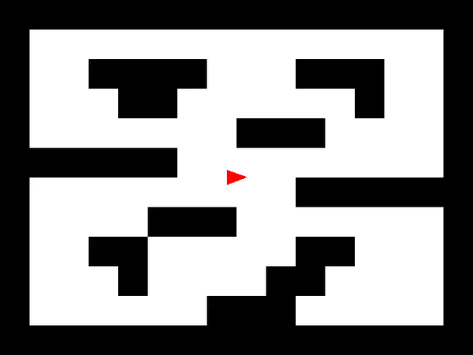
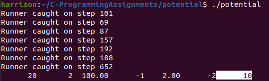
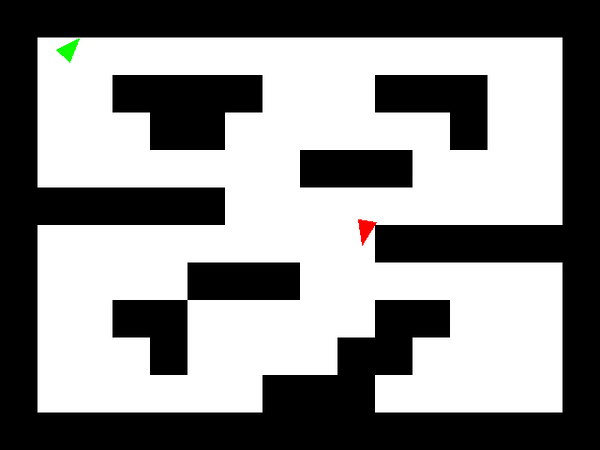

# C Programming Assignments

(NOTE: Course and instructor name omitted at his request, likely to prevent future students from finding and referencing this repository for solutions)

This set of programs can be grouped into robotics-related and general utility/string parsing programs. The robot programs either build on each other or are using a similar infrastructure, while the others were code challenges meant to demonstrate different fundamental coding concepts. While other programming assignments were completed for the course, these were the most interesting and comprehensive of the bunch.

## Robot:
### *collision*
From polygons.csv, takes in the vertices (up to 16), rotation, and translation of two polygons and determines whether they "collide", whth ich we define as either intersecting or having one shape nested inside of the other.

### *braitenberg*
Simulates the behavior of a Braitenberg vehicle (https://en.wikipedia.org/wiki/Braitenberg_vehicle) in an environment with three lamps, complete with collision detection and resolution, and visualizes it in the form of a bitmap image:

### *chase*
A runner and chaser robot are placed in a maze layout. The runner performs one of three randomized actions: increase forward velocity, increase counter-clockwise rotational velocity, or do nothing. The chaser, whose goal is to catch the runner, has those same three actions, and a fourth that allows it to increase clockwise rotational velocity. It uses a tree search with a depth of 4 (aka 256 unique outcomes) to determine its best action, with a scoring system that rewards minimal distance to the chaser and high velocities. Different start positions for the chaser robot yield different outcomes (i.e. how many time steps necessary to catch the runner).

### *manual*
Takes in keyboard input to make the robot either move forward or rotate.

### *potential*
Similar to the robot chase problem, a potential field is used to guide the chaser to the runner. Makeshift GUI is created in the terminal to modify the values pertaining runner start location, maximum velocity, and weight of runner distance and obstacle distances. Number of time steps before the chaser catches the runner is printed in the terminal as well.

## String Parsing:
### *bigrams*
Takes in a .txt file (in our case, Jane Austen's *Pride and Prejudice*) and generates a dictionary of all the bigrams (two-word combinations) in the text and their number of occurrences. Dynamic memory allocation and Fx Hash (32-bit) is used to create the hash table. When more than half of the table is filled, the table doubles in size in order to avoid excess collisions, then prints the collisions for the previous and newly expanded tables for comparison. Once the program finishes constructing the table, it prints to the terminal all bigrams with at least 200 occurrences. If none reach 200, it prints all bigrams. Lastly it print out the total number of bigrams.

### *cryptogram*
Program takes in an "encrypt" or "decrypt" command, a password, and a normal string of text. The letters in the password indicate the change that should be applied to the corresponding letters in the string during encryption, i.e. 'a' shifts by 0, 'b' shifts by 1, 'z' shifts by 25, etc. The case (upper or lower) of each letter in the string is preserved, and the password is looped through until the end of the string is reached. Decryption follows similar guidelines, but in the reverse direction. Non-alphabet characters are ignored in both the password and string. For example, *./cryptogram encrypt abc 'aaaaaa'* yields *abcabc* and *./cryptogram decrypt abc 'Hfnlp Yosnd!'* yields *Hello World!*.

### *spellcheck*
Uses a ternary search tree to list out suggested spelling corrections given an input word. Accounts for insertion, deletion, replacement, and transposition errors.
